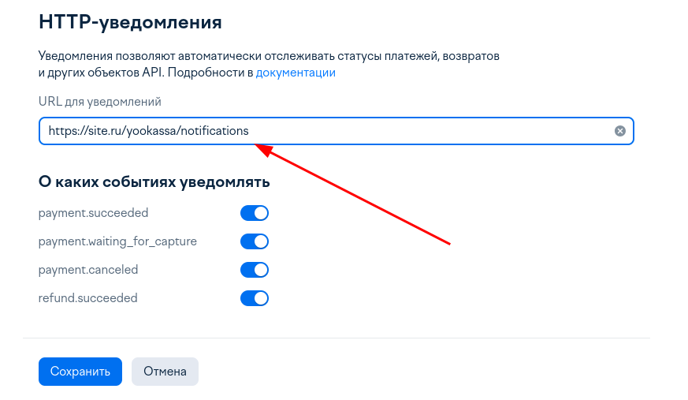

# Laravel Yookassa

## О пакете

Интеграция Yookassa на основе SDK yoomoney/yookassa-sdk-php.<br>
Предоставляет URL для уведомлений /yookassa/notifications<br>
Возвращает модель платежа Nos\YooKassa\Models\YookassaPayment<br>
Соьытие о смене статуса Nos\Yookassa\Events\YooKassaPaymentNotification<br>
Привязка к плательщику на стороне приложения.

## Установка

composer require imjonos/laravel-yoo-kassa

## Как использовать

Добавить в .env <br>

YOOKASSA_SHOP_ID= <br>
YOOKASSA_API_KEY= <br>
YOOKASSA_RETURN_URL= <br>

```php
//Фасад <br>
use Nos\Yookassa\Facades\YookassaFacade;
$yookassaPayment = YookassaFacade::createPayment(10, 'test'); 

//Сервис
$service = app(Nos\YooKassa\Services\PaymentService::class);
$yookassaPayment = $service->createPayment(10, 'test');
```

```php
Класс YookassaPayment
@property string $id
@property string $confirmation_url
@property string $status
@property float $amount
@property string $currency
@property string $description
@property array $metadata
@property int $recipient_account_id
@property int $recipient_gateway_id
@property bool $refundable
@property bool $test
```

Для приема уведомлений нужно добавить URL



И подписаться на событие Nos\Yookassa\Events\YooKassaPaymentNotification<br>

```php
namespace App\Providers;
class EventServiceProvider extends ServiceProvider
...
    protected $listen = [<br>
        YooKassaPaymentNotification::class => [<br>
        YookassaPaymentStatus::class<br>
    ]
];
...
```

```php
namespace App\Listeners;
class YookassaPaymentStatus implements ShouldQueue
...
public function handle(YooKassaPaymentNotification $event): void
{
    if ($event->payment->status === PaymentStatus::SUCCEEDED->value) {
    }
}
```

# MIT License

Copyright (c) 2023 Eugeny Nosenko

Permission is hereby granted, free of charge, to any person obtaining a copy
of this software and associated documentation files (the "Software"), to deal
in the Software without restriction, including without limitation the rights
to use, copy, modify, merge, publish, distribute, sublicense, and/or sell
copies of the Software, and to permit persons to whom the Software is
furnished to do so, subject to the following conditions:

The above copyright notice and this permission notice shall be included in all
copies or substantial portions of the Software.

THE SOFTWARE IS PROVIDED "AS IS", WITHOUT WARRANTY OF ANY KIND, EXPRESS OR
IMPLIED, INCLUDING BUT NOT LIMITED TO THE WARRANTIES OF MERCHANTABILITY,
FITNESS FOR A PARTICULAR PURPOSE AND NONINFRINGEMENT. IN NO EVENT SHALL THE
AUTHORS OR COPYRIGHT HOLDERS BE LIABLE FOR ANY CLAIM, DAMAGES OR OTHER
LIABILITY, WHETHER IN AN ACTION OF CONTRACT, TORT OR OTHERWISE, ARISING FROM,
OUT OF OR IN CONNECTION WITH THE SOFTWARE OR THE USE OR OTHER DEALINGS IN THE
SOFTWARE.
